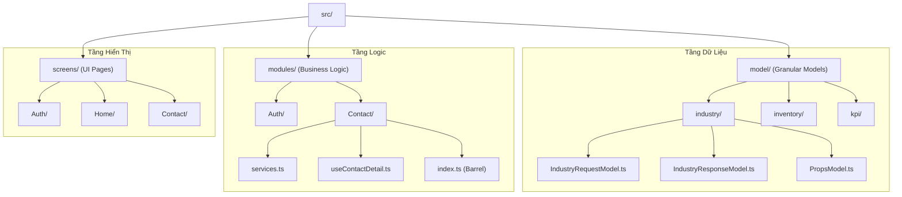

# React Native Project Structure & Coding Standards

> [!IMPORTANT]
> **QUY TẮC BẮT BUỘC**: Mọi tính năng, nghiệp vụ dù là nhỏ nhất (Small Feature/Entity) **BẮT BUỘC** phải được tách thành một thư mục riêng biệt. Không để các file models hoặc logic của nhiều tính năng trộn lẫn trong cùng một thư mục cha.

## Sơ đồ Tổng quan (The CRM Way)

Dưới đây là sơ đồ quy hoạch mã nguồn theo phong cách CRM để đảm bảo tính kiểm soát tuyệt đối:



## Directory Structure (Inside `src/`)

All source code must reside within the `src/` directory.

```text
src/
├── assets/             # Static files: images, fonts, icons
├── components/         # Global shared UI components (Atomic design)
├── configs/            # Application configuration
├── constants/          # Constant values (Enums, Screen names)
├── hooks/              # Global custom hooks
├── navigation/         # React Navigation configurations
├── modules/            # Feature-based modules (High level business logic)
│   ├── Auth/           # Each folder is a distinct module/feature
│   ├── Contact/
│   └── Order/
├── model/              # <--- Granular Model definition (Model-First)
│   ├── industry/       # Each feature model in its own folder
│   │   ├── IndustryRequestModel.ts
│   │   ├── IndustryResponseModel.ts
│   │   └── PropsModel.ts
│   └── inventory/
├── screens/            # Main screen components (Pages)
├── services/           # Global services (Network, Storage)
├── theme/              # Design system tokens
├── types/              # Global TypeScript types
└── utils/              # Global helper functions
```

## Feature-Based Organization (Modular Approach)

Để quản lý code dễ dàng khi dự án phình to, mỗi tính năng (module) lớn hoặc model nên được quy hoạch vào một thư mục riêng trong `src/modules/` hoặc `src/model/`.

## Quy hoạch Model Chi tiết (Granular Model Pattern)

Theo phong cách "tách từng tí một" để tối ưu khả năng mở rộng và kiểm soát, mỗi Model của tính năng sẽ được tổ chức như sau:

### Cấu trúc thư mục `src/model/`:
Mỗi thư mục con đại diện cho một đối tượng nghiệp vụ (Business Entity) hoặc tính năng.

```text
src/model/[FeatureName]/
├── [FeatureName]RequestModel.ts   # Interface/Type dữ liệu gửi lên API
├── [FeatureName]ResponseModel.ts  # Interface/Type dữ liệu API trả về
└── PropsModel.ts                  # Type cho Component Props của tính năng
```

**Lợi ích:**
- **Rõ ràng**: Biết chính xác nơi tìm cấu trúc dữ liệu của một tính năng.
- **Dễ bảo trì**: Khi API thay đổi (Request/Response), bạn chỉ cần sửa trong folder tương ứng.
- **Tái sử dụng**: Dễ dàng import các model này vào các `services` hoặc `screens` khác nhau.

---

## Lộ trình Triển khai 1 Tính năng (Step-by-Step)

Để đảm bảo tính nhất quán và dễ mở rộng, hãy tuân theo các bước sau khi thêm tính năng mới:

### Bước 1: Khởi tạo Model (Model-First)
Trước khi viết UI hay Logic, hãy định nghĩa cấu trúc dữ liệu trong `src/model/[FeatureName]/`:
- `[FeatureName]RequestModel.ts`: Chứa các fields cần gửi lên server.
- `[FeatureName]ResponseModel.ts`: Chứa các fields server trả về.
- `PropsModel.ts`: Chứa props của Component chính (nếu cần).

### Bước 2: Tạo Service (Networking)
Sử dụng các Model đã tạo để viết API call trong `src/modules/[FeatureName]/services/` (hoặc `src/services/api/` nếu là global).
- *Tip*: Ép kiểu Response trả về bằng `ResponseModel` để có gợi ý code (Intellisense) tốt nhất.

### Bước 3: Viết Logic (Hooks)
Tách logic xử lý (loading state, validation, data transformation) vào `src/modules/[FeatureName]/hooks/`.
- Tên file/hook: `use[FeatureName].ts`.

### Bước 4: Xây dựng UI (Components & Screens)
- Tạo screens trong `src/screens/[FeatureName]/`.
- Nếu screen phức tạp, tách các phần nhỏ thành components trong `src/modules/[FeatureName]/components/`.

---

## Quản lý Import (Barrel Files)

Để tránh các dòng import dài lê thê và khó kiểm soát, hãy sử dụng file `index.ts` ở cấp Module:

```typescript
// src/modules/Contact/index.ts
export * from './services';
export * from './hooks/useContactDetail';
export * from './components/ContactItem';
```

Khi đó ở nơi khác bạn chỉ cần: `import { useContactDetail, ContactItem } from '@/modules/Contact';`

## Quy trình Đặt tên (Naming Best Practices)

- **Hậu tố (Suffix)**: Luôn dùng hậu tố để phân loại file (Ví dụ: `...RequestModel.ts`, `...ResponseModel.ts`, `...Styles.ts`, `...Utils.ts`).
- **Rõ ràng > Ngắn gọn**: Thà đặt `InvoiceDetailResponseModel.ts` còn hơn là `InvoiceRes.ts`. Tên dài giúp việc tìm kiếm (Search file) cực nhanh và chính xác.
- **Tách biệt**: Không bao giờ để 2 interfaces khác nhau trong cùng 1 file nếu chúng thuộc về 2 thực thể khác nhau.

---

## Deep-Dive: Chi tiết Kỹ thuật từng tầng

### 1. Tầng Model (Data Definition)
Đây là "hợp đồng" dữ liệu. Mọi thay đổi logic đều bắt đầu từ đây.

**Ví dụ: `src/model/industry/IndustryResponseModel.ts`**
```typescript
export interface IIndustryItem {
  id: string;
  name: string;
  code: string;
  isActive: boolean;
}

export interface IndustryResponseModel {
  data: IIndustryItem[];
  total: number;
  message?: string;
}
```

### 2. Tầng Service (Data Fetching)
Sử dụng Model để đảm bảo dữ liệu luôn đúng kiểu.

**Ví dụ: `src/modules/Industry/services.ts`**
```typescript
import axios from 'axios';
import { IndustryResponseModel } from '@/model/industry/IndustryResponseModel';
import { IndustryRequestModel } from '@/model/industry/IndustryRequestModel';

export const IndustryService = {
  getList: async (params: IndustryRequestModel): Promise<IndustryResponseModel> => {
    const response = await axios.get('/api/industry', { params });
    return response.data;
  },
  
  update: async (id: string, data: Partial<IndustryRequestModel>): Promise<void> => {
    await axios.put(`/api/industry/${id}`, data);
  }
};
```

### 3. Tầng Hook (Business Logic)
Nơi xử lý giao tiếp giữa Service và UI. Tách biệt hoàn toàn Logic khỏi View.

**Ví dụ: `src/modules/Industry/hooks/useIndustryList.ts`**
```typescript
import { useState, useEffect } from 'react';
import { IndustryService } from '../services';
import { IIndustryItem } from '@/model/industry/IndustryResponseModel';

export const useIndustryList = () => {
  const [data, setData] = useState<IIndustryItem[]>([]);
  const [loading, setLoading] = useState(false);

  const fetchIndustries = async () => {
    setLoading(true);
    try {
      const res = await IndustryService.getList({ page: 1, limit: 10 });
      setData(res.data);
    } finally {
      setLoading(false);
    }
  };

  useEffect(() => {
    fetchIndustries();
  }, []);

  return { data, loading, refresh: fetchIndustries };
};
```

### 4. Tầng Component (UI/View)
UI chỉ nhận dữ liệu từ Hook và hiển thị. Không chứa logic nghiệp vụ phức tạp.

**Ví dụ: `src/modules/Industry/components/IndustryList.tsx`**
```typescript
import React from 'react';
import { View, Text, FlatList, ActivityIndicator } from 'react-native';
import { useIndustryList } from '../hooks/useIndustryList';

export const IndustryList = () => {
  const { data, loading } = useIndustryList();

  if (loading) return <ActivityIndicator />;

  return (
    <FlatList
      data={data}
      keyExtractor={(item) => item.id}
      renderItem={({ item }) => (
        <View>
          <Text>{item.name}</Text>
        </View>
      )}
    />
  );
};
```

---

## Tại sao phải tách nhỏ đến mức "nguyên tử"?

1.  **Dễ kiểm soát lỗi**: Khi màn hình "Industry" bị lỗi hiển thị dữ liệu, bạn biết ngay vấn đề nằm ở `IndustryResponseModel` (sai kiểu) hoặc `useIndustryList` (sai logic xử lý).
2.  **Làm việc nhóm cực tốt**: Một người có thể tập trung viết tất cả `models`, người khác viết `services`, và người thứ ba làm `UI`. Không ai chạm vào file của ai.
3.  **Tự động hóa**: Cấu trúc lặp đi lặp lại giúp bạn có thể dùng các công cụ generator để tạo nhanh boilerplate cho tính năng mới chỉ trong 1 giây.
4.  **Tối ưu Testing**: Bạn có thể viết Unit Test cho từng tầng riêng biệt một cách dễ dàng.

---

### 1. Files & Directories
- **Directories**: `kebab-case` (e.g., `user-profile`)
- **Components**: `PascalCase` (e.g., `PrimaryButton.tsx`)
- **Hooks**: `camelCase` starting with `use` (e.g., `useAuth.ts`)
- **Services/Utils**: `camelCase` (e.g., `formatDate.ts`)

### 2. Variables & Functions
- **Variables**: `camelCase`
- **Constants**: `UPPER_SNAKE_CASE`
- **Component Props**: `camelCase`

## Architectural Guidelines

### 1. Component Design
- Keep components small and focused on a single responsibility.
- Use **Functional Components** with Hooks.
- Prefer **Container/Presentational** pattern for complex screens if logic is heavy.

### 2. Styling (Theming)
- Do not hardcode colors. Use the `theme` object.
- Use `StyleSheet.create()` for performance.
- Keep styles in the same file as the component or a sibling `.styles.ts` file if they exceed 50 lines.

### 3. State Management
- Use **Zustand** or **Redux Toolkit** for global state.
- Use **React Context** for theme, auth, or localized feature state.
- Use **React Query (TanStack Query)** for server state (caching/fetching).

### 4. API & Networking
- Centralize API logic in `services/api/`.
- Handle errors globally using interceptors.

---
*Created by Antigravity*
